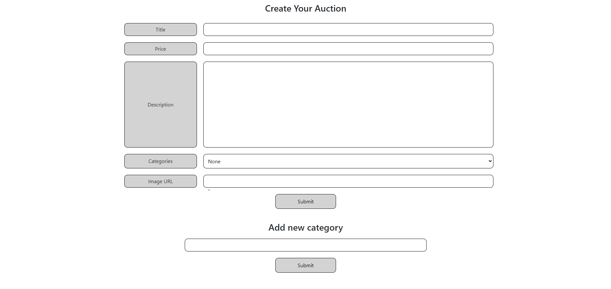
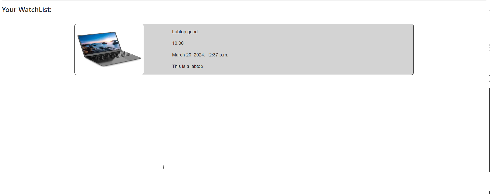

# Project 2 - Commerce

&nbsp;&nbsp;&nbsp;&nbsp;This is my third project in my CS50’s Web Programming with Python and JavaScript course that I taken. In this project, I have to design an eBay-like e-commerce auction site that will allow users to post auction listings, place blids on listings, comment on thos lestings, and add listings to a "watchlist."

## Specification

* Models
    * This project include a total of 6 models
        * User - Stores all the user information
        * Categorie - Stores all the categories in this website
        * Item - Store all the data of each item. The data are images, date created, title, description, category, user, is_active
        * Price - Display the highest price of the item, the user that holds the highest bid, and the item
        * Commnet - Display the comments of each item, commented by whom, and on which item
        * Watchlist - Display all watchlist item that belongs to each user

* Create Listing
    * The user will be able to create new listing. They will able to specify a title for the listing, a text-based description, and what the starting bid should be. Users should also optionally be able to provide a URL for an image for the listing and/or a category.
    * This page will also allow you to add more categories

* Active Listings Page
    * The default route of the web application will let users view all of the currently active auction listings.

* Listing Page
    * Clicking on a listing will take users to a page specific to that listing. On that page, users will be able to view all details about the listing, including the current price for the listing.
        * If the user is signed in, the user will be able to add the item to their “Watchlist.” If the item is already on the watchlist, the user will be able to remove it.
        * If the user is signed in, the user will be able to bid on the item. The bid must be at least as large as the starting bid, and must be greater than any other bids that have been placed (if any). If the bid doesn’t meet those criteria, the user will be presented with an error.
        * If the user is signed in and is the one who created the listing, the user will have the ability to “close” the auction from this page, which makes the highest bidder the winner of the auction and makes the listing no longer active.
        * If a user is signed in on a closed listing page, and the user has won that auction, the page will say so.
        * Users who are signed in will be able to add comments to the listing page. The listing page will display all comments that have been made on the listing.

* Watchlist
    * Users who are signed in will be able to visit a Watchlist page, which should display all of the listings that a user has added to their watchlist. Clicking on any of those listings should take the user to that listing’s page.

* Categories
    * Users will be able to visit a page that displays a list of all listing categories. Clicking on the name of any category should take the user to a page that displays all of the active listings in that category.

* Django Admin Interface
    * Via the Django admin interface, a site administrator should be able to view, add, edit, and delete any listings, comments, and bids made on the site

## Pages

### Home Page / Active Listing Page

### Close Listing Page

### Create Page

### Watchlist Page

### Admin Page

